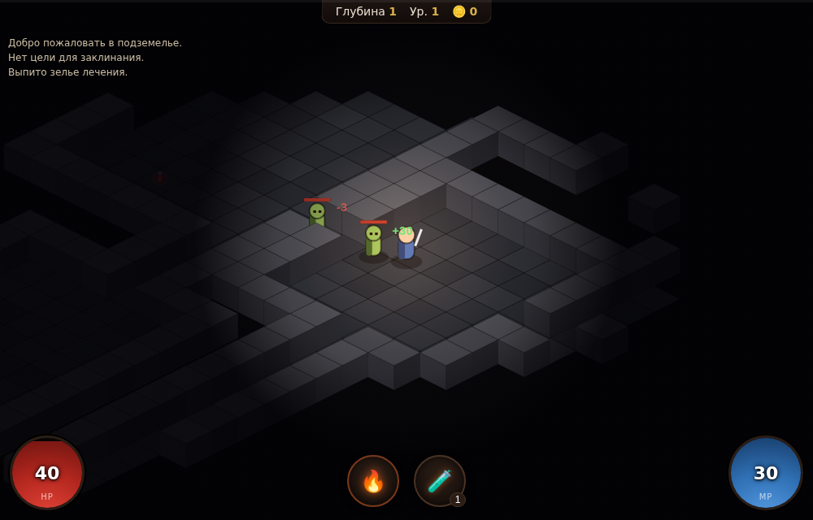

# ☠ Подземелье — мини-Diablo

Изометрический экшен-RPG (dungeon crawler) в духе **Diablo 1**, mobile-first.
Чистый **Canvas 2D + ES-модули, без библиотек и сборки** — как и остальной
код этого репозитория.



## Запуск

ES-модули требуют HTTP (не `file://`):

```bash
cd diablo-game
python3 -m http.server 8000      # → http://localhost:8000
```

## Управление

Игра управляется **тапами/кликами** — одинаково на телефоне и ПК.

| Действие | Жест |
|---|---|
| Идти | тап по полу (удерживай и веди — идёшь за пальцем) |
| Атаковать | тап по видимому врагу (подойдёт и бьёт в ближнем бою) |
| Авто-атака | подходишь вплотную к врагу — бьёшь сам |
| 🔥 Фаербол | кнопка заклинания (тратит ману, бьёт по ближайшей цели) |
| 🧪 Зелье | кнопка лечения (восстанавливает HP) |
| Спуск глубже | встань на **▼ лестницу** |

## Что внутри

- **Изометрический рендер (2:1)** — объёмные стены-блоки, каменный пол,
  процедурная графика без внешних ассетов.
- **Факельное освещение + туман войны** — видно только вокруг героя.
- **Процедурные подземелья** — комнаты + коридоры, у каждого уровня свой seed;
  чем глубже, тем больше и злее монстры.
- **Тап-движение с поиском пути (A*)** вокруг стен.
- **Бой**: ближний (по таймеру атаки) + дальнее заклинание-снаряд (мана).
- **Монстры с ИИ**: патруль → погоня (поиск пути к герою) → атака. Типы:
  падший, скелет, зомби, демон — со своими статами.
- **Лут**: золото и зелья падают с врагов, подбираются ходьбой.
- **Прокачка**: опыт за убийства → уровни (растут HP/мана/урон).
- **HP/мана-сферы** как в Diablo, опыт-полоса, лог событий.
- **Спуск по этажам**: каждый глубже — сложнее.

## Архитектура (`js/`, ES-модули)

| Модуль | Ответственность |
|---|---|
| `rng.js` | seeded PRNG + хелперы |
| `iso.js` | изометрическая математика (грид ↔ экран, глубина) |
| `dungeon.js` | процедурная генерация уровня, тайлы, проходимость, лестница |
| `pathfind.js` | A* по сетке (8 направлений, без срезания углов) |
| `entities.js` | игрок и архетипы монстров, прокачка |
| `render.js` | Canvas-2D: пол, стены, существа, снаряды, свет/туман |
| `ui.js` | HUD (сферы/полосы/кнопки/лог) + числа урона, кольца целей |
| `game.js` | состояние, ввод, обновление (движение/ИИ/бой/лут), спуск |
| `main.js` | связывание, ввод (тап/удержание), игровой цикл |

## Баланс / настройки

- Статы игрока и монстров — в `js/entities.js` (`makePlayer`, `MONSTERS`,
  масштабирование по глубине).
- Размер уровня, число комнат, плотность монстров — в `js/dungeon.js` и
  `Game._loadLevel` (`js/game.js`).
- Радиус обзора (туман войны) — `VISION` в `js/game.js`.
- Изометрические размеры тайлов/стен — `js/iso.js`.

## Совместимость

Нужен Canvas 2D (есть везде). На телефоне играть удобнее в книжной или
альбомной ориентации — сферы и кнопки под большими пальцами.
