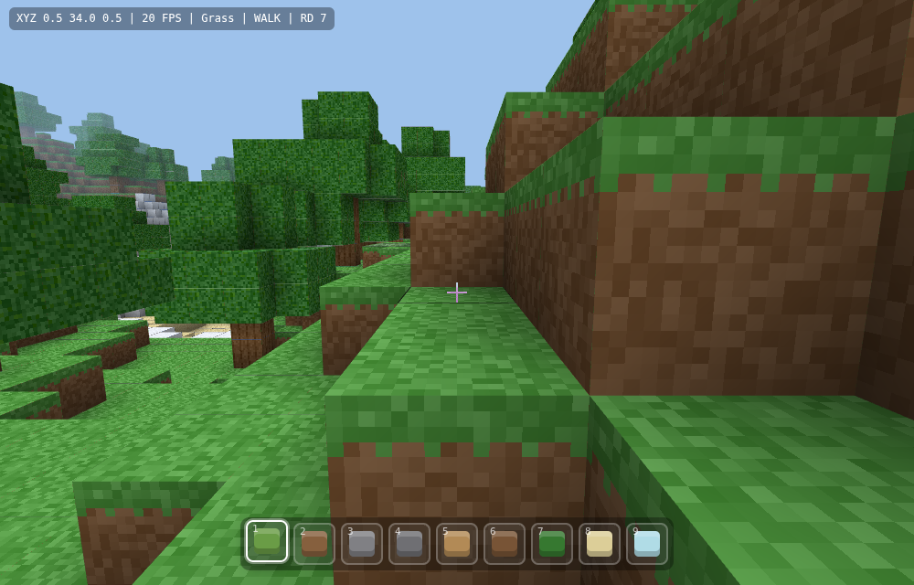

# ⛏ Воксель-мир — мини-Майнкрафт

Браузерная воксельная песочница в духе Minecraft. **Чистый WebGL + ES-модули,
без библиотек, без сборки, без бэкенда** — ровно в духе этого репозитория.



## Запуск

ES-модули требуют HTTP (не `file://`). Любой статический сервер подойдёт:

```bash
cd voxel-game
python3 -m http.server 8000      # → http://localhost:8000
# или: npx serve .
```

Открой страницу, нажми **«Играть»** (захват мыши) и исследуй мир.

## Управление

| Действие | Клавиши |
|---|---|
| Движение | `W` `A` `S` `D` (или стрелки) |
| Осмотр | мышь |
| Прыжок / вверх (в полёте) | `Пробел` |
| Бег / вниз (в полёте) | `Shift` |
| Сломать блок | ЛКМ |
| Поставить блок | ПКМ |
| Выбрать блок | `1`…`9` или колесо мыши |
| Режим полёта | `F` |
| Дальность прорисовки | `[` и `]` |
| Пауза (отпустить мышь) | `Esc` |

## Что внутри

- **Бесконечный процедурный мир** — холмы, горы, пляжи, вода, деревья, снежные
  вершины. Генерация детерминирована по seed (Perlin/fbm).
- **Чанковая подгрузка** вокруг игрока с бюджетом генерации/мешинга на кадр и
  выгрузкой далёких чанков (буферы GL освобождаются).
- **Меш с отсечением граней + ambient occlusion** и направленным затенением
  (верх ярче, бока темнее) — мягкие тени в углах.
- **Процедурный атлас текстур** рисуется на canvas в рантайме (никаких картинок).
- **Физика от первого лица** — гравитация, прыжок, AABB-коллизия по осям.
- **Разрушение/постановка блоков** через voxel-raycast (Amanatides & Woo) с
  подсветкой выделенного блока.
- **Полупрозрачная вода** отдельным проходом с блендингом.
- 9 видов блоков на хотбаре: трава, земля, камень, булыжник, доски, дерево,
  листва, песок, стекло.

## Архитектура (`js/`, один IIFE-граф ES-модулей)

| Модуль | Ответственность |
|---|---|
| `glmatrix.js` | mat4 (perspective/lookAt/multiply) + vec3 — подмножество glMatrix |
| `noise.js` | seeded Perlin, fbm, хеш для декораций |
| `blocks.js` | константы мира, id блоков, грани→тайлы, хотбар |
| `textures.js` | процедурный атлас на 2D-canvas, `tileUV` |
| `world.js` | чанки, генерация рельефа, деревья, get/set блоков, правки |
| `mesher.js` | геометрия чанка: отсечение граней, AO, затенение |
| `renderer.js` | WebGL: шейдеры, атлас, проходы opaque/water, рамка выделения |
| `player.js` | ввод, физика, AABB-коллизия, raycast |
| `main.js` | игровой цикл, стриминг чанков, ввод, HUD, хотбар |

## Настройки

В начале `js/main.js`:

- `RENDER_DISTANCE` — радиус прорисовки в чанках (в игре меняется `[` / `]`).
- `GEN_BUDGET` / `MESH_BUDGET` — сколько чанков генерировать/мешить за кадр.
- `FOV`, `SENS` — поле зрения и чувствительность мыши.

Размер/высота мира и уровень моря — в `js/blocks.js`
(`CHUNK_SX`, `CHUNK_SY`, `CHUNK_SZ`, `SEA_LEVEL`).

## Совместимость

Нужен WebGL1 (есть во всех современных браузерах). Производительность зависит от
GPU; при тормозах уменьши `RENDER_DISTANCE` клавишей `[`.
